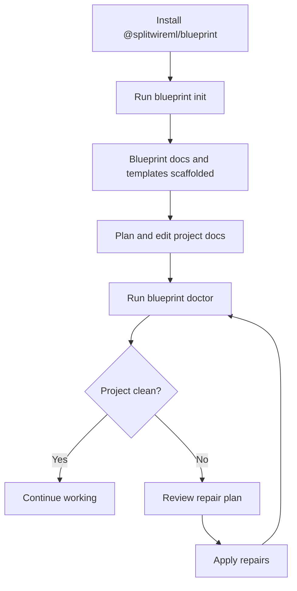

# Blueprint CLI

Blueprint CLI is the public command-line release for Blueprint scaffolding and project integrity checks. The package installs as `@splitwireml/blueprint`, and the executable stays `blueprint`.

## Install

```bash
npm install -g @splitwireml/blueprint
```

- Supported Node.js: `>=18.0.0`
- Public release contract: [release contract](https://github.com/masterbatcoderman10/blueprint-cli/blob/main/docs/release-contract.md)

## What M1 Supports

M1 focuses on Blueprint scaffolding and repository health:

- `blueprint init` scaffolds the Blueprint docs, templates, and managed agent files into the current repository.
- `blueprint doctor` audits the current Blueprint project, reports drift or missing canonical files, and can guide repairs.
- `blueprint link` is a placeholder command boundary for future cross-project linking work.
- `blueprint context` is a placeholder command boundary for future cross-project context surfacing.

This release is intentionally narrow. It does not yet implement cross-project context automation, workflow visibility commands, or post-MVP coordination features from later milestones.

## Quick Start

```bash
mkdir my-project
cd my-project
blueprint init
blueprint doctor
```

`blueprint init` creates the Blueprint scaffolding needed to start planning inside the current repository. `blueprint doctor` validates that the canonical Blueprint files still match the expected structure after edits.

## Command Surface

### `blueprint init`

Use `blueprint init` to scaffold a new or existing repository for Blueprint planning.

What it does today:

- Creates the required `docs/` structure and Blueprint core modules
- Scaffolds editable project docs such as `docs/prd.md` and `docs/project-progress.md`
- Copies bundled templates that ship with the published package
- Sets up managed agent files during onboarding

### `blueprint doctor`

Use `blueprint doctor` to inspect an existing Blueprint project and optionally repair drift.

What it does today:

- Audits canonical Blueprint files and manifest state
- Reports missing, malformed, or drifted project files
- Builds a repair plan when fixes are available
- Re-runs validation after accepted repairs

### `blueprint link`

`blueprint link` remains part of the public CLI surface as a placeholder command boundary. In M1 it is present so future cross-project work has a stable entrypoint, but it does not yet implement linking behavior.

### `blueprint context`

`blueprint context` also remains a placeholder command boundary. In M1 it does not yet implement cross-project context loading, but the executable name and command slot are retained for future milestones.

## Workflow Diagrams




## Release Notes for Users

- Package name: `@splitwireml/blueprint`
- CLI executable: `blueprint`
- Published artifact includes compiled `dist/` output plus bundled `templates/`
- Release tags follow the stable semver format `vMAJOR.MINOR.PATCH`

## Boundaries

Blueprint CLI is not a general workflow orchestrator. It does not yet implement:

- Cross-project context automation
- Multi-project status or diff commands
- Workflow visibility enhancements from later milestones
- Features outside the current M1 command surface
