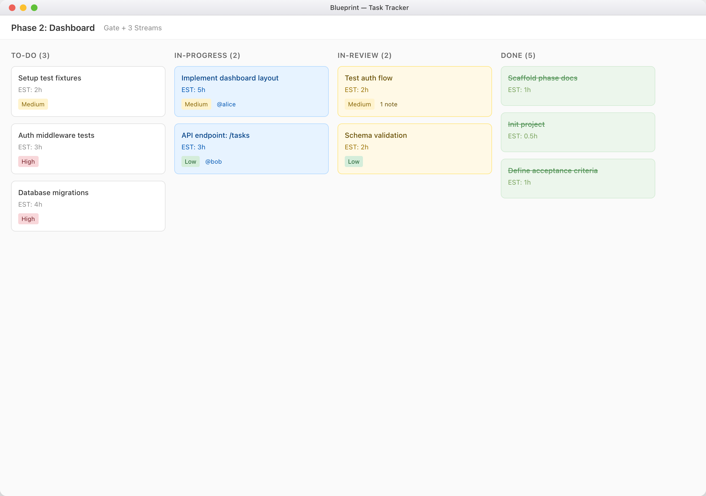

# Blueprint

**Skill-first development discipline for AI coding agents.** Blueprint gives Claude Code, Codex, Cursor, and human maintainers a shared operating loop: repo-local instructions, a Blueprint skill, structured planning docs, a task tracker, and release gates that survive across sessions.

[](https://www.npmjs.com/package/blueprint-agentic-development) [](https://nodejs.org/) [](#license)

Version `1.0.0` marks Blueprint's skill era: the CLI still scaffolds and repairs projects, but day-to-day agent work is now routed through the Blueprint skill so each session loads the right workflow guidance at the right time.

## Why Blueprint

AI agents can write code faster than a project can absorb it. The usual failure is not typing speed; it is drift. One session plans, another executes with stale context, tests become optional, review notes disappear into chat history, and nobody can tell which document represents the current truth.

Blueprint moves that operating context into the repository. The skill tells an agent which workflow module to load, the tracker stores task state, the docs capture phase and tweak contracts, and git records the handoff. Agents do not have to reconstruct the project from memory; they can resume from the repo.

## Install

Blueprint has two installation surfaces. Use both when you want the full workflow.

### 1. Install the Blueprint CLI

The Blueprint CLI scaffolds projects, audits project structure, and runs the local tracker board.

```bash
npm install -g blueprint-agentic-development
blueprint init
blueprint doctor
```

Requirements: Node.js `>=18.0.0` and npm.

### 2. Install the Blueprint Skill

Install the skill inside each project where you want Claude Code to discover Blueprint natively:

```bash
npx skills add masterbatcoderman10/blueprint-cli --skill blueprint
```

This is the recommended project-local install path. It writes the Blueprint skill into `.claude/skills/blueprint/`, where Claude Code discovery can find it for that repo. Avoid `-g` for the skill install path; global skill installs currently land outside the project-local discovery path that Claude Code uses most reliably.

The global CLI and the project-local Blueprint skill do different jobs. The CLI creates and checks the project. The skill tells the agent how to plan, execute, review, tweak, and commit work.

## Start A Project

```bash
mkdir my-project
cd my-project
git init
npm install -g blueprint-agentic-development
blueprint init
npx skills add masterbatcoderman10/blueprint-cli --skill blueprint
```

`blueprint init` creates the project docs, root agent entry points, Blueprint templates, and the tracker database at `docs/.blueprint/tasks.db`. After that, run `blueprint doctor` whenever you want to audit or repair the Blueprint structure.

Open the tracker board when you want a visual task surface:

```bash
blueprint board
blueprint board status
blueprint board stop
```



## The Skill Usage Loop

At the start of a session, invoke the Blueprint skill. In Codex, Claude Code, or another agent surface, that usually means the project root instructions say to use Blueprint, or you say it directly:

```text
Invoke the blueprint skill. Plan the next phase.
Invoke the blueprint skill. Execute stream R11-6.A.
Invoke the blueprint skill. Review this worktree.
Invoke the blueprint skill. Treat this as a tweak: tighten the README install section.
```

The skill starts with a setup gate:

1. Verify `docs/project-progress.md` exists and is populated.
2. Verify `docs/.blueprint/tasks.db` exists.
3. From the installed skill directory, run `node scripts/load-context.mjs` to load the current project state.

Then it routes the agent to only the workflow guidance needed for the request:

| Intent | What The Skill Loads |
|--------|----------------------|
| Plan a milestone or phase | Planning guidance plus the specific milestone or phase module |
| Execute work | Execution guidance, tracker rules, worktree discipline, and test-first expectations |
| Orchestrate a phase or stream | Orchestration guidance for coordinating gates, parallel streams, dependencies, and handoffs |
| Review work | Review guidance, acceptance checks, and note handling |
| Address review notes | Execution guidance for rework and re-review |
| Handle a tweak | Tweak classification, restatement, confirmation, change, verification, and post-hoc tweak record |
| Commit or release | Git workflow guidance and release discipline |

The important part is that the agent does not load every protocol at once. Blueprint keeps context narrow, makes the current workflow explicit, and leaves an audit trail in docs, tracker state, tests, and commits.

## Daily Workflow

1. Shape the product in `docs/prd.md` and `docs/srs.md`.
2. Plan a milestone, then plan one phase in enough detail to execute.
3. Break the phase into a Gate and parallel Streams.
4. Execute work from tracker tasks. Write or update tests before implementation.
5. Move completed work to review, address notes, and preserve review history.
6. Use the tweak loop for small contained changes that do not need a formal plan.
7. Close the phase only after tasks are done, verification is green, and progress docs are updated.

## Orchestration

Orchestration is where Blueprint becomes powerful for work larger than one focused task. A normal session can execute a gate or stream, but an orchestrator keeps the whole phase coherent: it reads the phase plan, identifies dependencies, starts the blocking Gate first, assigns independent Streams to separate agents or worktrees, and uses the tracker as the shared source of truth.

The orchestrator does not replace execution or review. It coordinates them. It watches for blocked streams, confirms dependency branches have landed before dependent work begins, routes bugs through the bug workflow, routes small corrections through the tweak loop, and makes sure review notes are addressed before a stream is considered done.

Use orchestration when a phase has parallel work, multiple agents, sequencing risk, or a handoff-heavy review cycle:

```text
Invoke the blueprint skill. Orchestrate the current phase.
Invoke the blueprint skill. Start the gate, then coordinate streams A and B.
Invoke the blueprint skill. Check which streams are blocked and what can run next.
```

The payoff is controlled parallelism. Agents can move quickly without all sharing the same context window, because the orchestrator keeps the plan, tracker state, worktrees, reviews, and phase-close criteria aligned.

## Commands

| Command | Status | Purpose |
|---------|--------|---------|
| `blueprint init` | Implemented | Scaffold Blueprint docs, templates, root agent files, and tracker storage |
| `blueprint doctor` | Implemented | Audit and repair Blueprint project structure |
| `blueprint alignment-complete` | Implemented | Validate marked supported root agent files before marking required files as alignment-complete |
| `blueprint migrate` | Implemented | Convert a legacy Blueprint project to skill mode in place; forces fresh Alignment, never preserves alignment-complete, and deletes `docs/core/**` during legacy conversion |
| `blueprint board` | Implemented | Run the local tracker board |
| `blueprint board status` | Implemented | Show the active board server, if one is running |
| `blueprint board stop` | Implemented | Stop the active board server |
| `blueprint link` | Reserved | Cross-project linking surface planned for later work |
| `blueprint context` | Reserved | Cross-project context surface planned for later work |

Runtime help currently guides users through `init`, `doctor`, `alignment-complete`, and `migrate`; the board commands are operational utilities for initialized Blueprint projects.

## Repository Anatomy

| Path | Purpose |
|------|---------|
| `docs/project-progress.md` | Current milestone, phase, status, and project log |
| `docs/prd.md` | Product requirements and product-level decisions |
| `docs/srs.md` | System requirements and locked implementation constraints |
| `docs/core/` | Human-readable Blueprint workflow documentation |
| `docs/milestones/` | Milestone and phase plans |
| `docs/tweaks/` | Post-hoc audit records for small contained changes |
| `docs/.blueprint/tasks.db` | Local tracker database |
| `.claude/skills/blueprint/` | Project-local Blueprint skill install for Claude Code |
| `.agents/skills/blueprint/` | Project-local Blueprint skill install for agent surfaces that read `.agents` |
| `skills/blueprint/` | Repo-root skill payload shipped in the npm package |
| `templates/` | Files copied or repaired by `blueprint init` and `blueprint doctor` |

## Releasing

Maintainers publish from stable semver tags:

```bash
npm run release:check
git tag v1.0.0
git push origin main --tags
```

`npm run release:check` runs install, typecheck, tests, build, package creation, and package artifact verification. Pushing a tag in the `vMAJOR.MINOR.PATCH` format triggers the GitHub Actions publish workflow.

See [docs/release-contract.md](docs/release-contract.md) and [docs/releasing.md](docs/releasing.md) for the maintainer contract.

## Learn More

- [Core workflow docs](docs/core/) for planning, execution, review, tweaks, bugs, and phase completion
- [Orchestration guide](docs/core/orchestrate.md) for coordinating gates, streams, agents, dependencies, and handoffs
- [Release contract](docs/release-contract.md) for package identity, tag rules, and publish checks
- [Maintainer release guide](docs/releasing.md) for release operations
- [Changelog](CHANGELOG.md) for historical release notes

## Contributing

Blueprint is open source. Found a bug or sharp edge? Open an issue in [masterbatcoderman10/blueprint-cli](https://github.com/masterbatcoderman10/blueprint-cli/issues).

## License

MIT. See [LICENSE](LICENSE) for details.
